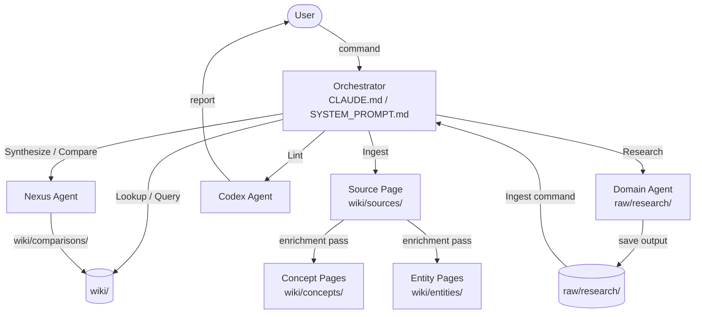

# obsidian-llm-wiki-kit

**A prompt-engineering starter kit for building a self-growing personal knowledge base in Obsidian, powered by any LLM.**

Drop notes into folders. Ask your LLM to research, ingest, and synthesize. Your wiki grows and cross-links itself — automatically, incrementally, permanently.

---

## The Idea (Karpathy's LLM Wiki)

This kit implements the pattern described by [Andrej Karpathy](https://karpathy.ai/llmwiki): treat your notes as **source material**, not as the final artifact. The LLM compiles them into a structured wiki that compounds over time.

```
You add raw material        LLM orchestrates          Wiki grows
─────────────────────────────────────────────────────────────────
raw/articles/post.md   →   Ingest [post.md]   →   wiki/concepts/
raw/papers/study.pdf   →   Research [topic]   →   wiki/entities/
raw/books/summary.md   →   Synthesize [idea]  →   wiki/comparisons/
```

The wiki lives in [Obsidian](https://obsidian.md) — so you get graph view, backlinks, and wikilinks for free. The LLM handles the bookkeeping.

**This project was built and open-sourced by [Rituparno Majumdar](https://github.com/Rituparno-Majumdar).**
Reference implementation also inspired by [kytmanov/obsidian-llm-wiki-local](https://github.com/kytmanov/obsidian-llm-wiki-local).

---

## Two Paths to Start

| I want to… | Go to… |
|---|---|
| Clone a ready-to-use template and customize manually | [`template-vault/`](#quick-start) |
| Generate a fully personalized system for my interests | [`meta-prompt-wizard/`](#personalization-wizard) |

---

## Quick Start

Get up and running in under 10 minutes.

**Prerequisites:** [Obsidian](https://obsidian.md) installed. An LLM of your choice (Claude, ChatGPT, Gemini, or local via Ollama).

### 1. Clone and copy the vault template

```bash
git clone https://github.com/Rituparno-Majumdar/obsidian-llm-wiki-kit.git
cp -r obsidian-llm-wiki-kit/template-vault ~/my-wiki
```

### 2. Open in Obsidian

File → Open Folder as Vault → select `my-wiki`

### 3. Configure your LLM

| Platform | What to do |
|---|---|
| **Claude Code** | Open `my-wiki` as your working directory. `CLAUDE.md` is auto-loaded. |
| **Claude Desktop** | Open `template-vault/SYSTEM_PROMPT.md`, copy contents → paste into Project Instructions |
| **ChatGPT** | Create a Custom GPT or Project, paste `SYSTEM_PROMPT.md` as instructions |
| **Gemini** | Create a Gem, paste `SYSTEM_PROMPT.md` as instructions |
| **Ollama / LM Studio** | Set `SYSTEM_PROMPT.md` contents as your system prompt |

### 4. Set your orchestrator name

Open `CLAUDE.md` or `SYSTEM_PROMPT.md` and replace `{{ORCHESTRATOR_NAME}}` with a name (e.g. `Curator`, `Atlas`, `Sage`).

### 5. Add your domain agents

See [`template-vault/agents/README.md`](template-vault/agents/README.md) to create domain-specific research agents, or use the wizard below to generate them automatically.

### 6. Test it

Type: `Lookup zettelkatten`

Your LLM should search the wiki, find nothing (empty vault is correct), and confirm it's ready for its first Ingest.

---

## Personalization Wizard

Instead of configuring manually, paste [`meta-prompt-wizard/WIZARD.md`](meta-prompt-wizard/WIZARD.md) into any LLM. It will ask you 5 sections of questions and generate:

- A fully populated `SYSTEM_PROMPT.md` (or `CLAUDE.md` for Claude Code)
- Domain agent files — one per topic you care about
- A vault initialization shell script
- Your personal routing table

See [`meta-prompt-wizard/README.md`](meta-prompt-wizard/README.md) for details and example transcripts.

---

## Features

- **8 built-in commands** — `Lookup`, `Ingest`, `Research`, `Query`, `Lint`, `Synthesize`, `Compare`, `fetch`
- **Domain agent system** — create specialist subagents for any research area
- **Karpathy enrichment protocol** — every ingest cross-links 3–5 existing concept pages automatically
- **Zettelkasten structure** — concepts, entities, sources, comparisons — all properly typed and linked
- **Multilingual support** — optional triad format (native script + transliteration + translation) for non-English content
- **LLM-agnostic** — works with Claude, ChatGPT, Gemini, and local models via Ollama or LM Studio
- **Vault hygiene** — Lint command (or `scripts/lint_vault.py`) finds orphans, broken links, missing frontmatter
- **Helper scripts** — `lint_vault.py` and `new_concept.py` for command-line use

---

## Architecture



---

## LLM Compatibility

| Feature | Claude Code | Claude Desktop | ChatGPT | Gemini | Ollama (70B+) |
|---|:---:|:---:|:---:|:---:|:---:|
| All 8 commands | ✅ | ✅ | ✅ | ✅ | ✅ |
| Sub-agents (separate files) | ✅ | ❌ | ❌ | ❌ | ❌ |
| Agent modes (in system prompt) | ✅ | ✅ | ✅ | ✅ | ✅ |
| File write to vault | ✅ | ❌ manual | ❌ manual | ❌ manual | depends |
| Web search in Research | ✅ | ✅ | ✅ | ✅ | ❌ |
| Multilingual triad format | ✅ | ✅ | ✅ | ✅ | ✅ |
| Wizard (WIZARD.md) | ✅ | ✅ | ✅ | ✅ | use SHORT |

For platforms without sub-agent support, domain agents are embedded as named modes in `SYSTEM_PROMPT.md`. The wizard handles this automatically.

---

## Vault Structure

```
template-vault/
├── CLAUDE.md              ← Claude Code system prompt (auto-loaded)
├── SYSTEM_PROMPT.md       ← LLM-agnostic system prompt (paste anywhere)
├── raw/
│   ├── articles/          ← web clips and blog posts (read only)
│   ├── papers/            ← PDFs and academic papers (read only)
│   ├── research/          ← AI-generated research outputs
│   ├── books/             ← chapter-by-chapter book summaries
│   ├── assets/            ← images and attachments
│   └── templates/         ← reusable prompt templates
├── wiki/
│   ├── concepts/          ← Zettelkasten concept pages (the core)
│   ├── entities/          ← people, orgs, tools, products
│   ├── sources/           ← one page per ingested source
│   ├── comparisons/       ← A-vs-B analysis pages
│   ├── index.md           ← master table of contents
│   ├── log.md             ← chronological activity log
│   └── overview.md        ← rolling 300-word synthesis
└── agents/
    ├── _TEMPLATE.md       ← blank agent skeleton
    └── examples/          ← three neutral example agents
```

---

## Example Workflow

```
You:  Research the philosophy of Stoicism [DEPTH: standard]

LLM:  → routes to your Philosophy agent (or Archivist generalist)
      → runs Lookup first: finds no existing Stoicism coverage
      → searches web, synthesizes 6,000-word research doc
      → saves to raw/research/2025-06-01-stoicism.md
      → returns: "Research complete. Run Ingest raw/research/2025-06-01-stoicism.md to add to wiki."

You:  Ingest raw/research/2025-06-01-stoicism.md

LLM:  → creates wiki/sources/Stoicism-Research.md
      → creates wiki/concepts/Stoicism.md
      → creates wiki/concepts/Logos.md
      → creates wiki/concepts/Apatheia.md
      → creates wiki/entities/Marcus-Aurelius.md
      → enrichment pass: links Stoicism → existing Virtue Ethics, Reason, Determinism pages
      → updates wiki/index.md and wiki/log.md
      → reports: "3 new concepts, 1 entity, 3 pages enriched"
```

---

## Customization

1. **Run the wizard** — paste `meta-prompt-wizard/WIZARD.md` into your LLM for a guided setup
2. **Add agents manually** — copy `template-vault/agents/_TEMPLATE.md`, fill in your domain, add to routing table
3. **Enable multilingual support** — see `docs/09-multilingual-guide.md` and `raw/templates/multilingual-research.md`
4. **Platform-specific setup** — see `docs/` for guides for each LLM platform

---

## Documentation

| File | Contents |
|---|---|
| `docs/01-quickstart.md` | 10-minute setup guide |
| `docs/02-setup-claude-code.md` | Claude Code setup |
| `docs/03-setup-claude-desktop.md` | Claude Desktop / Projects |
| `docs/04-setup-chatgpt.md` | ChatGPT Custom GPT / Projects |
| `docs/05-setup-gemini.md` | Gemini Gems |
| `docs/06-setup-local-ollama.md` | Ollama, LM Studio, Open WebUI |
| `docs/07-philosophy.md` | Karpathy LLM Wiki + Zettelkasten origins |
| `docs/08-creating-agents.md` | How to design domain agents |
| `docs/09-multilingual-guide.md` | Triad format for non-English content |
| `docs/10-troubleshooting.md` | Common issues by platform |

---

## FAQ

**Does this require coding skills?**
No. The "product" is Markdown prompt files. No installation, no build step, no dependencies (scripts are optional).

**What if my LLM doesn't support sub-agents?**
Use `SYSTEM_PROMPT.md` instead of `CLAUDE.md`. The wizard generates domain agents as "modes" embedded in a single file.

**Can I use this with a local model?**
Yes. Paste `SYSTEM_PROMPT.md` as the system prompt in Ollama, LM Studio, or Open WebUI. 70B+ models recommended for full feature parity. For smaller models, use `meta-prompt-wizard/WIZARD_SHORT.md`.

**Will my personal notes stay private?**
Yes. Your wiki content lives only in your local Obsidian vault. This repo contains zero personal data — only structure, prompts, and templates.

**Can I add agents for my own domains?**
Yes — that's the point. See `template-vault/agents/_TEMPLATE.md` and `docs/08-creating-agents.md`.

**How is this different from a RAG system?**
No embeddings, no vector database, no retrieval pipeline. The LLM reads Markdown files directly and maintains structure through prompt-enforced conventions. Simpler, more transparent, and works offline.

**Can I migrate an existing Obsidian vault?**
Yes. Copy your existing notes into `raw/articles/` and run `Ingest` on each one to build the wiki progressively.

**What Obsidian plugins do you recommend?**
The template ships with core plugins only. Popular additions: Dataview (query your wiki), Templater (automate frontmatter), Graph Analysis (visualize connections).

---

## Roadmap

- [ ] GitHub Actions CI: validate that wiki/ content dirs contain only .gitkeep
- [ ] More agent examples (science, law, creative writing, finance)
- [ ] `scripts/bulk_ingest.py` — batch ingest a folder of raw files
- [ ] AGENTS.md variant for Codex / OpenAI Agents SDK
- [ ] Video walkthrough

---

## Contributing

See [CONTRIBUTING.md](CONTRIBUTING.md). Agent examples, platform guides, wizard improvements, and script contributions are all welcome.

---

## License

MIT — see [LICENSE](LICENSE).

---

*Derived from [Andrej Karpathy's LLM Wiki](https://karpathy.ai/llmwiki) concept.*
*Reference implementation: [kytmanov/obsidian-llm-wiki-local](https://github.com/kytmanov/obsidian-llm-wiki-local).*
